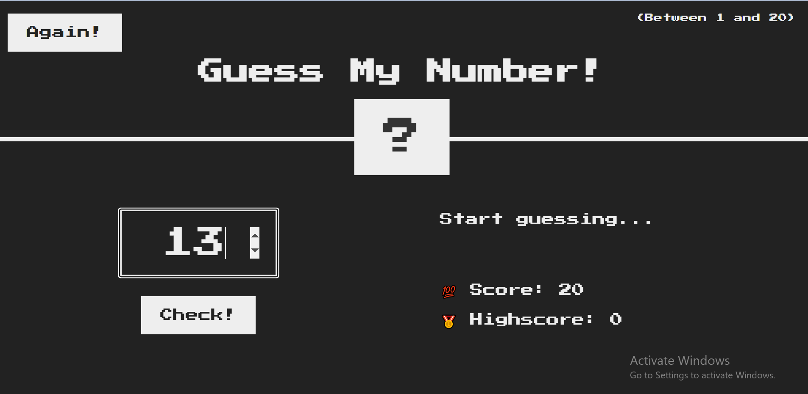
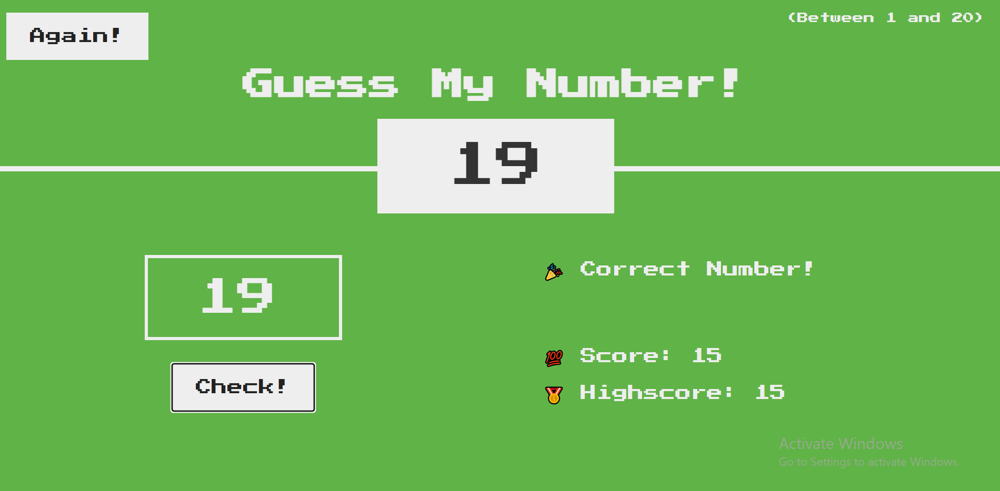

# Guess-Number-JS

🚀 Features -
Random number generation.
User input validation and feedback.
Score and high score tracking.
Responsive design.

🔧 Technologies Used -
HTML5: Structure of the webpage.
CSS3: Styling of the game.
JavaScript: Game logic and interactivity.

💻 How to Play -
Open the game in your browser.
Enter a number within the specified range.
Click on the "Check" button.
If your guess is too high or too low, hints will be provided.
Continue guessing until you find the correct number!

📧 Contact -
If you have any questions or feedback, reach out to me at amanturkubanychbekov5@gmail.com.

📸 Screenshot
 .

Win Case
 .

